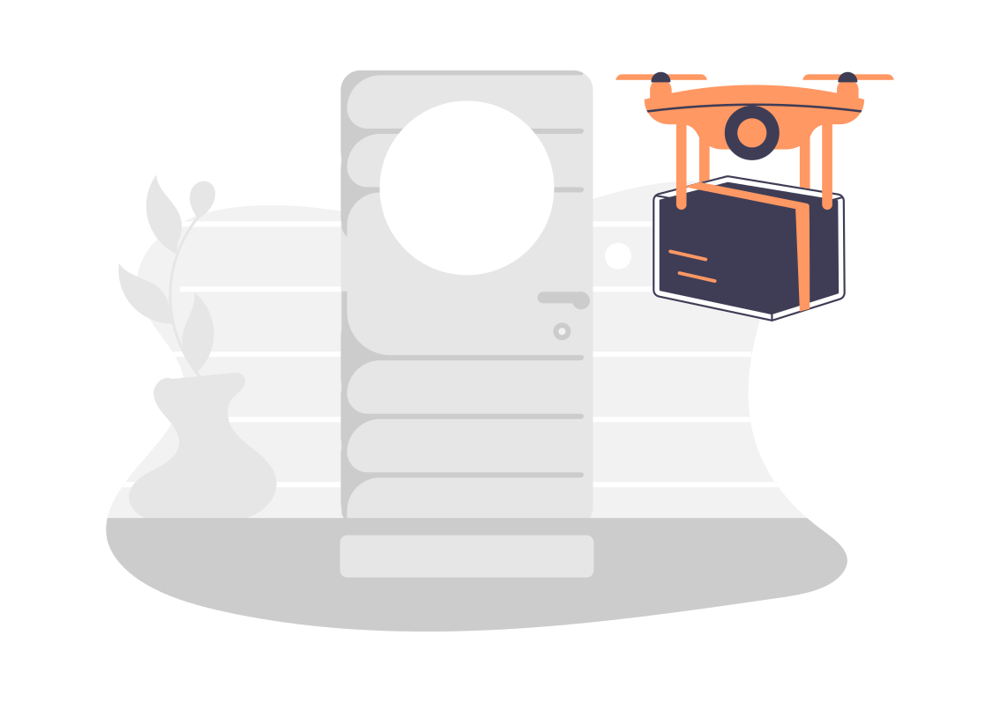

<div align="center">

# 🚁 AirSend 📦


Complete solution for drone delivery using Raspberry Pi and Docker Compose, integrating with ArduPilot flight controller. *The project uses a web interface and is designed to run on a Raspberry Pi or Pi Zero.*



</div>

## 📦 Integrations

<table align="center">

<tr>
<td>
  
<table>
<th colspan="2" style="text-align: center;">📦 Services</th>
<tr>
<td>
      
✅ PocketBase  
✅ Docker Compose  
✅ ArduPilot  

</td>
<td>

✅ Web Interface  
✅ Delivery Management  
✅ GPS Tracking  
✅ Real-time Monitoring  

</td>
</tr>
</table>

</td>
<td>
    
<table>
<th colspan="2" style="text-align: center;">🔧 Use Cases</th>
<tr>
<td>
      
📦 Package Delivery  
🛠️ Maintenance  
🌐 Remote Management  
🔋 Battery Monitoring  

</td>
<td>

🌍 Route Planning  
📉 Data Logging  
🚁 Flight Control  
📡 Communication  

</td>
</tr>
</table>

</td>
</tr>

</table>

---

## 🛠 System Dependencies

Ensure your system has the following dependencies installed:
- Docker
- Docker Compose

<details>
<summary>👈 View Installation Instructions</summary>
<p>

**Install Docker:**
```bash
curl -fsSL https://get.docker.com -o get-docker.sh
sudo sh get-docker.sh
```

**Install Docker Compose:**
```bash
sudo apt-get install -y docker-compose
```

</p>
</details>

---

## 🐳 Building the Docker Containers
Run the setup script to build and start the services:
```bash
git clone git@github.com:judahpaul16/airsend.git && cd airsend
docker compose up
```
*Run with `-d` to detach the container from the terminal session*

---

## ✅ Compatibility
...

---

## 📚 Useful Documentation

<table align="center">
<tr>
<td>

- [Raspberry Pi Docs](https://www.raspberrypi.com/documentation)
- [Docker Docs](https://docs.docker.com/)
- [PocketBase Docs](https://pocketbase.io/docs/)
- [ArduPilot Docs](https://ardupilot.org/ardupilot/index.html)
- [Flight Controller Setup](https://ardupilot.org/copter/docs/initial-setup.html)

</td>
</tr>
</table>

---

## 📜 License
This project is not yet licensed. A license will be added soon.