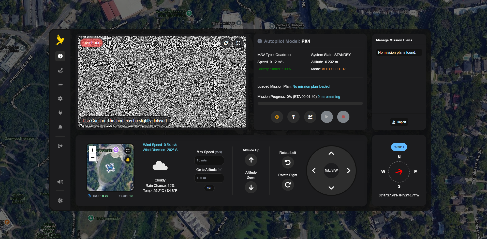
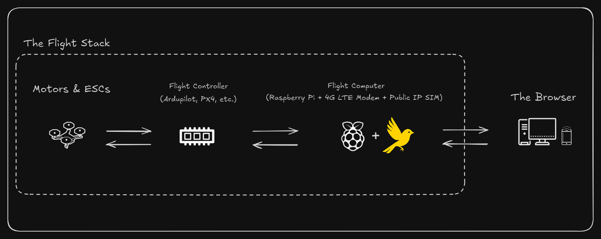

<div align="center">

<span style="color: red;">⚠️ **Warning**: This project is in **early development** and is not yet ready for production use. Use at your own risk! **It is your responsibility** to understand the risks involved as well as the **laws and regulations** governing the use of unmanned aerial vehicles (UAVs) in your area. ⚠️</span>


# 🚁 Canary Ground Control 📡

[](https://github.com/judahpaul16/canarygc/actions/workflows/ci.yml)


A web-based ground control station (GCS) for remote autopilot management via the [MAVLink protocol](https://en.wikipedia.org/wiki/MAVLink).



</div>

---

## 🤔 How Does It Work?

Unlike traditional GCS software, Canary Ground Control is a web-based application that runs on a Raspberry Pi, making it a part of the flight stack. This enables you to manage your autopilot from anywhere in the world, as long as you have an internet connection.



---

## ✨ Features

* **Live telemetry & control** over MAVLink: attitude, position, battery, GPS, flight-mode changes, arm/disarm, and a virtual D-Pad.
* **ArduPilot and PX4 support.** Flight-mode encoding and decoding is selected per autopilot through a strategy layer, so mode changes and armed-state readouts work on both stacks.
* **Mission planner** with a 2D map (Leaflet) and a 3D map (MapLibre).
* **Cross-autopilot missions.** A plan is stored autopilot-neutral and normalized to the connected stack on upload: ArduPilot runs the full command set, and PX4 substitutes or skips commands it cannot run and reports what changed.
* **Mission import.** Load QGroundControl `.plan` and Mission Planner `.waypoints` (QGC WPL) files, or the app's own JSON, straight into the planner.
* **Smart path optimization.** One click routes the mission clear of hazards without changing the waypoint order. It pulls FAA obstacles and OpenStreetMap building heights for the mission area and, where a leg would strike one, raises the leg to clear it when the ceiling allows or routes around it when it is too tall. Restricted airspace is always routed around, and a waypoint inside it is moved out. The map overlays refetch as you pan, and the airspace, hazard, and building lookups are cached per area.
* **Airspace overlays.** Both the 2D and 3D maps draw restricted and controlled airspace for the mission area, toggled from a map control, with a popup for each zone's class, altitude band, and operating implication. Worldwide coverage comes from [OpenAIP](https://www.openaip.net) with a key; without one it falls back to the FAA's keyless public airspace layers (US).
* **LAANC ceilings and obstacles.** Two more toggleable overlays from the FAA's keyless layers: the UAS Facility Map grid colored by each square's pre-approved ceiling, and Digital Obstacle File towers and structures colored by height, each with plain-language popups.
* **Pre-flight safety checks.** Before a mission starts, every waypoint is validated against an altitude ceiling and floor, a home-relative geofence radius, and the fetched airspace, and each leg is checked for passing through a zone. Restricted airspace, or a waypoint past a limit, blocks the launch; controlled airspace prompts for confirmation.
* **Audible callouts.** Spoken telemetry callouts (arm/disarm, mode changes, battery, GPS, failsafe, link loss) over the browser speech API, with an on/off toggle that defaults on.
* **Email alerts.** Enable per-event alerts (arm/disarm, mode change, failsafe, low battery, GPS or link loss, and more); each fires an email with the live coordinates and telemetry.
* **Integrations & password reset.** In-app settings for SMTP (your own mail server), airspace keys, and the operator email, which also backs an emailed, expiring password-reset link.
* **WebRTC camera feed** from an on-board Raspberry Pi camera via [MediaMTX](https://github.com/bluenviron/mediamtx).
* **Weather, compass, and stats** widgets on a customizable dashboard.
* **Build info** at `/version` (release tag, commit, build time).

---

## ❓ Why Not Just Use Mission Planner, QGC, or APM Planner (with Tailscale)?

You might ask:
“Why not just run an existing GCS (Mission Planner, QGC, APM Planner), and connect over Tailscale, either from a laptop, or running the GCS directly on the Raspberry Pi?”

> **TL;DR:**
> Traditional GCS software is designed for *desktop-based, short-range* semi-manual operation.
> CanaryGC is purpose-built for *embedded, LTE-connected, persistent, remote UAV control*, where every watt and packet counts.

### Running GCS on a laptop (with Tailscale to the drone):

1. **No Always-On Link**
   The GCS must be running on your laptop. If your laptop disconnects (or sleeps), telemetry is lost.
   CanaryGC runs *on the drone itself*, providing a persistent link, always available to any browser.

2. **Laptop Required**
   You must boot a laptop and connect Tailscale. CanaryGC works from any phone, tablet, or computer, no special software needed.

3. **Tailscale Reliability**
   VPN tunnels can be fragile over LTE or CG-NAT. CanaryGC supports public-IP SIMs or static tunnels with no VPN dependency.

---

### Running GCS **directly on the Pi** (with Tailscale + VNC / RDP):

1. **GUI Overhead**
   Traditional GCS software (QGC, Mission Planner, APM Planner) is designed as a desktop GUI app (Qt/X11). Running it on the Pi requires installing and running a full desktop environment (X11 server, GPU stack, window manager). This adds CPU and memory load, increases system complexity, and draws more power, reducing flight time.

2. **Remote Desktop Limitations**
   Accessing the Pi’s GUI remotely (via Tailscale + VNC/RDP) requires constant encoding and streaming of the desktop image, adding CPU load, using bandwidth, and introducing lag. Over LTE links, this results in poor responsiveness and unreliable control, unacceptable for UAV operations.

3. **Battery & Performance Impact**
   The additional CPU/GPU usage from running a desktop GCS and streaming remote sessions directly reduces battery life. It also impacts system responsiveness for other critical tasks (LTE modem handling, telemetry routing, camera streaming).

4. **Reliability Risks**
   Desktop-based GCS apps are not designed for connection interruptions or lossy networks. VNC/RDP sessions can freeze or drop if connectivity is poor. Recovery often requires manual intervention, not ideal for autonomous or long-range flights.

5. **Increased Maintenance**
   Installing and maintaining a full desktop stack and GUI-based GCS on the Pi adds software complexity, increases boot time, and introduces more failure points. Field systems should be simple and robust.

---

### Why CanaryGC’s Web-Native, Headless Design Is Better

CanaryGC is designed for **headless, remote-first UAV deployments**:

* It runs as a lightweight background service, no X11, no desktop.
* The Pi can run a minimal OS, saving power and booting faster.
* Users connect via a web browser, no VNC or desktop tunnels needed.
* The Pi streams only telemetry and control data, not full-screen images, making it far more efficient over LTE links.
* The interface gracefully handles network interruptions and reconnects.
* It works from any device (phone, tablet, laptop) with a browser, ideal for field operations.

---

## 🐚 Setup Script

### Production Deployment
```bash
curl -s https://raw.githubusercontent.com/judahpaul16/canarygc/main/contrib/setup.sh | \
    bash -s --
```

### Local Testing with SITL
```bash
curl -s https://raw.githubusercontent.com/judahpaul16/canarygc/main/contrib/setup.sh | \
    bash -s -- --simulation
```

### Install-Only (Without System Setup)
```bash
curl -s https://raw.githubusercontent.com/judahpaul16/canarygc/main/contrib/setup.sh | \
    bash -s -- --install-only
```

---

## 🧑‍💻 Local Development

The stack is a single `docker-compose.yml` with two profiles.

**Development** runs the SvelteKit dev server with hot reload against an ArduPilot SITL container:

```bash
docker compose --profile development up
```

The app is served at `http://localhost:5173`; SITL exposes MAVLink on TCP `5760`. Set a different host port with `APP_DEV_PORT` in a root `.env` if 5173 collides. The first bring-up builds the ArduPilot SITL image from source (Copter 4.5.7), which takes a while; later runs reuse it, and the simulator streams telemetry about a minute after it starts.

On first run the database is empty, so open `/register` to create the operator account. To reset it later, wipe the dev database and restart:

```bash
docker exec canarygc_app sh -c 'rm -f /app/src/data.db*'
docker restart canarygc_app
```

The schema recreates empty on the next boot, and the app then prompts for first-run operator setup.

**Production** builds the Node server image and runs the WebRTC camera bridge, talking to a real autopilot over UART:

```bash
docker compose --profile production up app webrtc
```

The app is served at `http://localhost:3000`.

### Gates

From `compose/svelte-kit`, mirroring CI:

```bash
npm ci                              # install from the lockfile
npm run lint                        # eslint
npm run check                       # svelte-check
npm run build                       # production build
npm audit --audit-level=moderate    # dependency audit
```

---

## ⚙️ Configuration

The app reads its configuration from environment variables (see `compose/svelte-kit/.env.example`):

| Variable | Purpose |
| --- | --- |
| `DATABASE_PATH` | Path to the SQLite database file (migrated on first boot). |
| `OPENAIP_API_KEY` | [OpenAIP](https://www.openaip.net) key for worldwide airspace. Without it, airspace falls back to the FAA's keyless US layers. |
| `VITE_ALTITUDE_ANGEL_API_KEY` | Optional key for the Altitude Angel airspace endpoint. |
| `SMTP_HOST`, `SMTP_PORT`, `SMTP_SECURE`, `SMTP_USER`, `SMTP_PASS`, `MAIL_FROM` | SMTP for password-reset and alert email. |

The airspace keys and SMTP settings are also editable in-app under **Integrations**, which stores them in the database and takes precedence over the environment.

---

## 📜 License
This software is made available under the MIT License. See the [`LICENSE`](LICENSE.md) file for more information.
