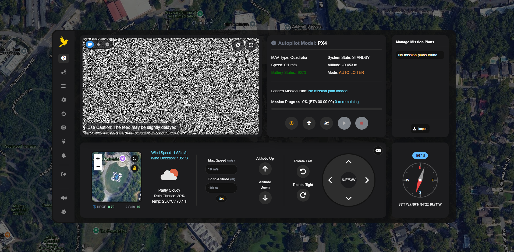
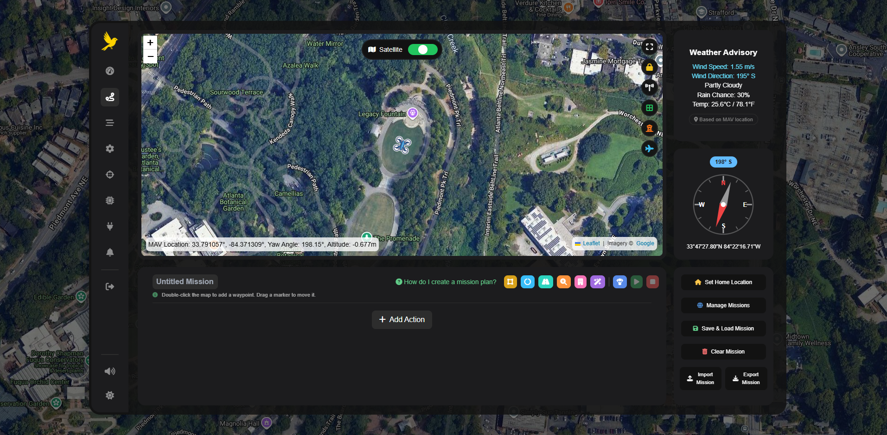
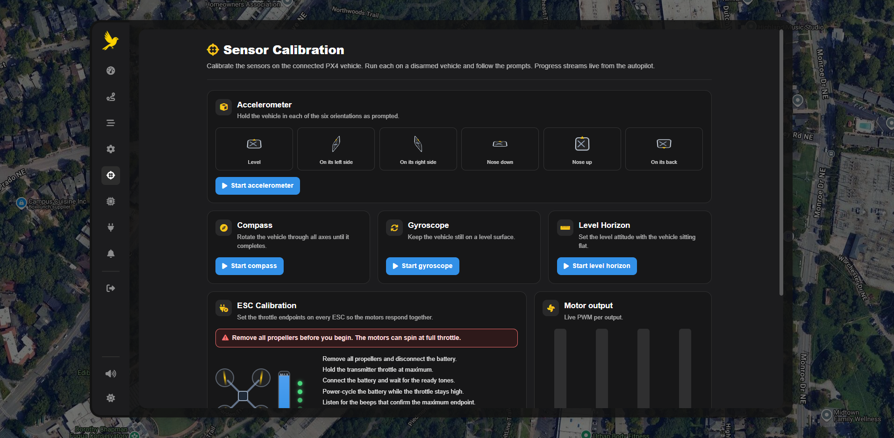
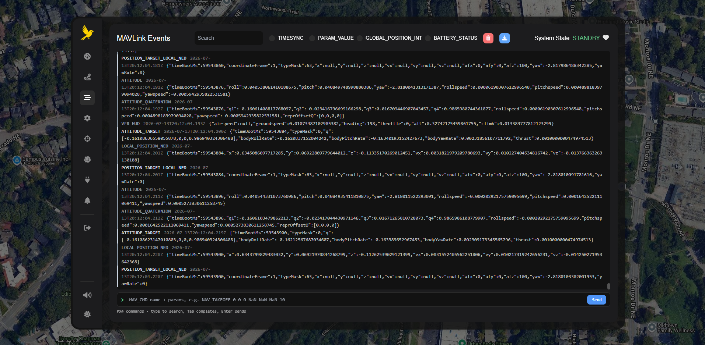
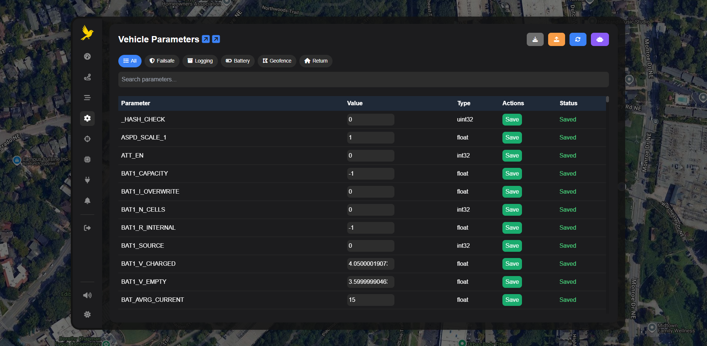

<div align="center">

<span style="color: red;">⚠️ **Warning**: This project is in **early development**. Use at your own risk! **It is your responsibility** to understand the risks involved as well as the **laws and regulations** governing the use of unmanned aerial vehicles (UAVs) in your area.</span>


# 🚁 Canary Ground Control 📡

[](https://github.com/judahpaul16/canarygc/actions/workflows/ci.yml?query=branch%3Amain)


A web-based ground control station (GCS) for remote autopilot management via the [MAVLink protocol](https://en.wikipedia.org/wiki/MAVLink).


<table>
  <tr>
    <td width="50%">
      <br>
      <sub>Mission planning</sub>
    </td>
    <td width="50%">
      <br>
      <sub>Calibration</sub>
    </td>
  </tr>
  <tr>
    <td width="50%">
      <br>
      <sub>MAVLink Events</sub>
    </td>
    <td width="50%">
      <br>
      <sub>Vehicle Parameters</sub>
    </td>
  </tr>
</table>

</div>

## 🐚 TL;DR | Setup Script

### Production Deployment
```bash
curl -s https://raw.githubusercontent.com/judahpaul16/canarygc/main/contrib/setup.sh | \
    bash -s --
```

### Local Testing with SITL
```bash
curl -s https://raw.githubusercontent.com/judahpaul16/canarygc/main/contrib/setup.sh | \
    bash -s -- --simulation
```

### Install-Only (Without System Setup)
Skips the host provisioning (installing Docker, nginx, and the other system packages, the UFW firewall and 4G routing rules, the Docker daemon config, and the Raspberry Pi UART overlays) and just brings the app up with Docker Compose, assuming Docker is already installed and running.
```bash
curl -s https://raw.githubusercontent.com/judahpaul16/canarygc/main/contrib/setup.sh | \
    bash -s -- --install-only
```


---

## 🤔 How Does It Work?

Unlike traditional GCS software, Canary Ground Control is a web-based application that runs on a Raspberry Pi, making it a part of the flight stack. This enables you to manage your autopilot from anywhere in the world, as long as you have an internet connection.


The reference hardware build (Raspberry Pi 4B, Holybro S500 V2, camera, and 4G modem) is documented in the [Build guide](https://github.com/judahpaul16/canarygc/wiki/Build).

---

## ✨ Features

* **Live telemetry & control** over MAVLink: attitude, position, battery, GPS, flight-mode changes, arm/disarm, and a virtual D-Pad.
* **ArduPilot and PX4 support.** Flight-mode encoding and decoding is selected per autopilot through a strategy layer, so mode changes and armed-state readouts work on both stacks.
* **Mission planner** with a 2D map (Leaflet) and a 3D map (MapLibre). A single persistent map renders behind every page; the planner and dashboard mini-map are windows into it, and fullscreen expands the same map. Waypoint legs draw as smooth curves, and the map toggles (overlays, view lock, street/satellite/3D) persist for the browser session.
* **Configurable basemaps.** Light, dark, and hybrid-satellite tiles resolve from a MapTiler key (with keyless fallbacks), and the map swaps to a real dark basemap when the theme toggles. Each mode's tile source is overridable in Integrations with a preset dropdown or a custom XYZ URL.
* **Cross-autopilot missions.** A plan is stored autopilot-neutral and normalized to the connected stack on upload: ArduPilot runs the full command set, and PX4 substitutes or skips commands it cannot run and reports what changed.
* **Mission import.** Load QGroundControl `.plan` and Mission Planner `.waypoints` (QGC WPL) files, the app's own JSON, a Google Earth `.kml` or `.kmz`, or a plain coordinate `.csv`, straight into the planner.
* **Mission patterns.** Five generators in the planner: click an area's corners for serpentine survey transects at a chosen spacing, grid angle, and altitude; click a center for an orbit ring; draw a path for a corridor of parallel lanes across a width; drop a datum for an expanding-square search; or click a structure for a scan of stacked orbit rings that spiral up. The survey and orbit patterns follow QGroundControl's.
* **Gamepad flight.** A toggle streams a connected gamepad as MAVLink `MANUAL_CONTROL` (Mode 2 sticks, 20 Hz, hover-centered thrust), with a connect dialog that previews live stick input. Enabling in flight switches the vehicle to its stick-flying mode (PX4 Position, ArduPilot Loiter); ending the stream hands it back to an autonomous hold.
* **Smart path optimization.** One click routes the mission clear of hazards without reordering waypoints: it raises legs over FAA obstacles and OpenStreetMap buildings when the ceiling allows, routes around them when it does not, and always routes around restricted airspace. Overlays refetch as you pan and lookups are cached per area.
* **Airspace overlays.** Both the 2D and 3D maps draw restricted and controlled airspace for the mission area, toggled from a map control, with a popup for each zone's class, altitude band, and operating implication. Worldwide coverage comes from [OpenAIP](https://www.openaip.net) with a key; without one it falls back to the FAA's keyless public airspace layers (US).
* **LAANC ceilings and obstacles.** Two more toggleable overlays on both maps from the FAA's keyless layers: the UAS Facility Map grid colored by each square's pre-approved ceiling, and Digital Obstacle File towers and structures colored by height, each with plain-language popups.
* **Live air traffic.** A toggleable ADS-B layer on both maps draws nearby aircraft with heading, altitude, and speed, merging traffic reported by the vehicle's onboard receiver (`ADSB_VEHICLE`) with keyless community network feeds (adsb.lol, adsb.fi).
* **Pre-flight safety checks.** Before a mission starts, every waypoint is validated against an altitude ceiling and floor, a home-relative geofence radius, and the fetched airspace, and each leg is checked for passing through a zone. Restricted airspace, or a waypoint past a limit, blocks the launch; controlled airspace prompts for confirmation.
* **Audible callouts.** Spoken telemetry callouts (arm/disarm, mode changes, battery, GPS, failsafe, link loss) over the browser speech API, with an on/off toggle that defaults on.
* **Email alerts.** Enable per-event alerts (arm/disarm, mode change, failsafe, low battery, GPS or link loss, and more); each fires an email with the live coordinates and telemetry.
* **Color-coded event log.** The `/event-log` stream colors each MAVLink event by message type and severity, with per-message filters, search highlighting, and one-click log download.
* **MAVLink command console.** A console under the event stream sends raw `MAV_CMD`s with autocomplete over the detected autopilot's command set, per-command parameter hints, input validation, and history; the resulting `COMMAND_ACK` shows up in the stream above it.
* **Flight controller firmware.** A Firmware tab flashes all four stacks. It detects a connected Betaflight or INAV board over the MultiWii Serial Protocol (MSP), browses the live INAV, Betaflight, ArduPilot, and PX4 catalogs, and flashes: an INAV target hex or a Betaflight cloud build over USB DFU, an ArduPilot `.apj` or PX4 `.px4` over the autopilot's own serial bootloader (CRC-verified), or any Intel HEX. It can reboot a board into its DFU bootloader first, and each provider explains release versus target.
* **Sensor calibration.** A `/calibration` page runs accelerometer (six-position), level-horizon, gyroscope, compass, and ESC calibration, adapting the MAVLink commands and progress parsing to the connected autopilot, with an animated orientation guide and a live status log.
* **Vehicle parameters.** Read, edit, search, import, and export the full parameter set. Curated quick-config chips filter the table to failsafe, logging, OSD, battery, geofence, and return parameters (matched to the connected autopilot) and annotate the common ones with plain-language descriptions.
* **AI PID tuning.** From the parameters page, the current rate and attitude gains plus recent vibration and attitude telemetry go to an OpenAI-compatible endpoint (OpenAI, a LiteLLM proxy, or a local Ollama, configured in Integrations), and the returned gain suggestions apply with one click.
* **MAVLink signing.** A shared passphrase set in Integrations signs every outbound message and verifies inbound ones, MAVLink 2 authentication with replay protection, so a publicly reachable link accepts commands only from a holder of the key. Strict mode also rejects unsigned messages.
* **Integrations & password reset.** In-app settings for SMTP (your own mail server), airspace keys, map tiles, and the operator email, which also backs an emailed, expiring password-reset link.
* **WebRTC camera feed** from an on-board Raspberry Pi camera via [MediaMTX](https://github.com/bluenviron/mediamtx).
* **Weather, compass, and stats** widgets on a customizable dashboard.
* **Build info** at `/version` (release tag, commit, build time).

---

## ❓ Why Not Just Use Mission Planner, QGC, or APM Planner (with Tailscale)?

You might ask:
“Why not just run an existing GCS (Mission Planner, QGC, APM Planner), and connect over Tailscale, either from a laptop, or running the GCS directly on the Raspberry Pi?”

> **TL;DR:**
> Traditional GCS software is designed for *desktop-based, short-range* semi-manual operation.
> CanaryGC is purpose-built for *embedded, LTE-connected, persistent, remote UAV control*, where every watt and packet counts.

### Running GCS on a laptop (with Tailscale to the drone):

1. **No Always-On Link**
   The GCS must be running on your laptop. If your laptop disconnects (or sleeps), telemetry is lost.
   CanaryGC runs *on the drone itself*, providing a persistent link, always available to any browser.

2. **Laptop Required**
   You must boot a laptop and connect Tailscale. CanaryGC works from any phone, tablet, or computer, no special software needed.

3. **Tailscale Reliability**
   VPN tunnels can be fragile over LTE or CG-NAT. CanaryGC supports public-IP SIMs or static tunnels with no VPN dependency.

---

### Running GCS **directly on the Pi** (with Tailscale + VNC / RDP):

1. **GUI Overhead**
   Traditional GCS software (QGC, Mission Planner, APM Planner) is designed as a desktop GUI app (Qt/X11). Running it on the Pi requires installing and running a full desktop environment (X11 server, GPU stack, window manager). This adds CPU and memory load, increases system complexity, and draws more power, reducing flight time.

2. **Remote Desktop Limitations**
   Accessing the Pi’s GUI remotely (via Tailscale + VNC/RDP) requires constant encoding and streaming of the desktop image, adding CPU load, using bandwidth, and introducing lag. Over LTE links, this results in poor responsiveness and unreliable control, unacceptable for UAV operations.

3. **Battery & Performance Impact**
   The additional CPU/GPU usage from running a desktop GCS and streaming remote sessions directly reduces battery life. It also impacts system responsiveness for other critical tasks (LTE modem handling, telemetry routing, camera streaming).

4. **Reliability Risks**
   Desktop-based GCS apps are not designed for connection interruptions or lossy networks. VNC/RDP sessions can freeze or drop if connectivity is poor. Recovery often requires manual intervention, not ideal for autonomous or long-range flights.

5. **Increased Maintenance**
   Installing and maintaining a full desktop stack and GUI-based GCS on the Pi adds software complexity, increases boot time, and introduces more failure points. Field systems should be simple and robust.

---

### Why CanaryGC’s Web-Native, Headless Design Is Better

CanaryGC is designed for **headless, remote-first UAV deployments**:

* It runs as a lightweight background service, no X11, no desktop.
* The Pi can run a minimal OS, saving power and booting faster.
* Users connect via a web browser, no VNC or desktop tunnels needed.
* The Pi streams only telemetry and control data, not full-screen images, making it far more efficient over LTE links.
* The interface gracefully handles network interruptions and reconnects.
* It works from any device (phone, tablet, laptop) with a browser, ideal for field operations.

---

## 🧑‍💻 Local Development

The stack is a single `docker-compose.yml` with `development`, `development-px4`, `development-betaflight`, `development-inav`, and `production` profiles.

Before the first bring-up, copy the environment template (optional; the stack runs on defaults without it):

```bash
cp .env.example .env    # host ports and app config, one file at the repo root
```

The root `.env` feeds both Docker Compose (host ports, which SITL vehicle to run, the image) and the app container (API keys, MSP, database); the Integrations page overrides the app keys at runtime.

**Development** runs the SvelteKit dev server with hot reload against an ArduPilot SITL container:

```bash
docker compose --profile development up -d
```

The app is served at `http://localhost:5173`; SITL exposes MAVLink on TCP `5760`. Set a different host port with `APP_DEV_PORT` in a root `.env` if 5173 collides. The first bring-up builds the ArduPilot SITL image from source (Copter 4.5.7), which takes a while; later runs reuse it, and the simulator streams telemetry about a minute after it starts. The stack runs detached; follow its output with:

```bash
docker compose --profile development logs -f
```

The SITL image builds the copter, rover, plane, and sub binaries, so the same `development` profile flies any of them. `SITL_VEHICLE` and `SITL_MODEL` pick which, and the dashboard controls adapt to the vehicle: a submarine gets a depth control (Go to Depth, Ascend, Descend), a rover drops the vertical control, and a plane, copter, or sub keeps Max Speed:

```bash
SITL_VEHICLE=Rover     SITL_MODEL=rover    docker compose --profile development up -d   # ground rover
SITL_VEHICLE=ArduSub   SITL_MODEL=vectored docker compose --profile development up -d   # submarine
SITL_VEHICLE=ArduPlane SITL_MODEL=plane    docker compose --profile development up -d   # fixed wing
```

To develop against **PX4** instead, use the `development-px4` profile:

```bash
docker compose --profile development-px4 up -d
```

This runs headless PX4 SITL (Gazebo) alongside a MAVProxy bridge that presents PX4's MAVLink on the same TCP `5760`, so the app connects identically. Both dev profiles bind `5760`, so run one at a time. PX4 SITL streams telemetry about a minute after Gazebo finishes initializing.

To exercise the **Firmware tab against a Betaflight or INAV flight controller** with no hardware, use the `development-betaflight` or `development-inav` profile:

```bash
docker compose --profile development-betaflight up -d   # or development-inav
```

Each builds the flight-controller firmware for the host CPU (SITL) and serves MSP on TCP `5761`, which the app reaches through the shared `msp-sitl` alias. The Firmware tab detects the board and reads its identity over MSP, as it would a real board on a serial link. These profiles carry no MAVLink autopilot, so the dashboard link stays offline; they cover MSP detection and telemetry.

On first run the database is empty, so open `/register` to create the operator account. To reset it later, wipe the dev database and restart:

```bash
docker exec canarygc_app sh -c 'rm -f /app/src/data.db*'
docker restart canarygc_app
```

The schema recreates empty on the next boot, and the app then prompts for first-run operator setup.

**Production** builds the Node server image and runs the WebRTC camera bridge, talking to a real autopilot over UART:

```bash
docker compose --profile production up -d app webrtc
```

The app is served at `http://localhost:3000`.

### Gates

From `compose/svelte-kit`, mirroring CI:

```bash
npm ci                              # install from the lockfile
npm run lint                        # eslint
npm run check                       # svelte-check
npm test                            # vitest unit suite
npm run build                       # production build
npm audit --audit-level=moderate    # dependency audit
```

### End-to-end tests

The Playwright suite in `compose/svelte-kit/e2e` drives the dev stack on
`localhost:5174` and authenticates by minting a session for the operator
account straight into `src/data.db`, so the stack must be up and the operator
account created (first run). Browsers install once with
`npx playwright install --with-deps chromium`.

```bash
npm run test:e2e                    # planner, event log, persistence
E2E_SITL=1 npm run test:e2e         # adds the SITL flight: arm, takeoff, move, climb, yaw
```

The flight spec flies the simulator, so run it against a freshly started
`development-px4` profile; a lockstep SITL under heavy host load drifts. The
suite runs single-worker because every spec shares one app and one vehicle.

---

## ⚙️ Configuration

The app reads its configuration from environment variables (see the root `.env.example`):

| Variable | Purpose |
| --- | --- |
| `DATABASE_PATH` | Path to the SQLite database file (migrated on first boot). |
| `OPENAIP_API_KEY` | [OpenAIP](https://www.openaip.net) key for worldwide airspace. Without it, airspace falls back to the FAA's keyless US layers. |
| `VITE_ALTITUDE_ANGEL_API_KEY` | Optional key for the Altitude Angel airspace endpoint. |
| `SMTP_HOST`, `SMTP_PORT`, `SMTP_SECURE`, `SMTP_USER`, `SMTP_PASS`, `MAIL_FROM` | SMTP for password-reset and alert email. |

The airspace keys and SMTP settings are also editable in-app under **Integrations**, which stores them in the database and takes precedence over the environment.

---

## 🤝 Contributing

Contributions are welcome. [CONTRIBUTING.md](CONTRIBUTING.md) covers the development setup, the CI gates, the commit markers that drive versioning, and the branch workflow.

---

## 📜 License
This software is made available under the MIT License. See the [`LICENSE`](LICENSE.md) file for more information.
