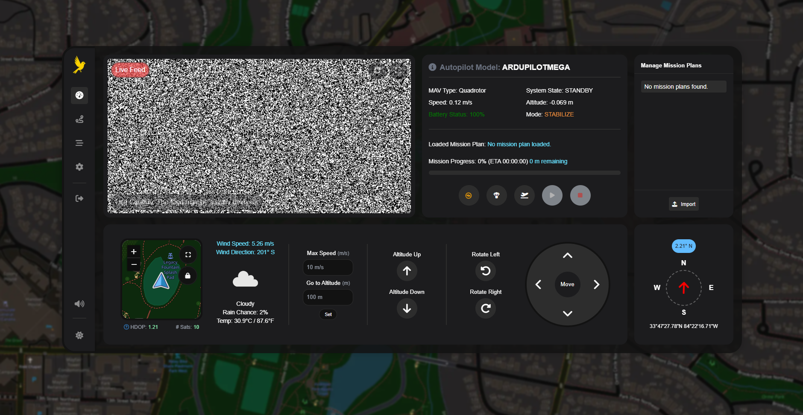

<div align="center">

<span style="color: red;">⚠️ **Warning**: This project is in **early development** and is not yet ready for production use. Use at your own risk! **It is your responsibility** to understand the risks involved as well as the **laws and regulations** governing the use of unmanned aerial vehicles (UAVs) in your area. ⚠️</span>


# 🚁 Canary Ground Control 📡


A web-based ground control station (GCS) for remote autopilot management via the [MAVLink protocol](https://en.wikipedia.org/wiki/MAVLink).



</div>

---

## 🤔 How Does It Work?

Unlike traditional GCS software, Canary Ground Control is a web-based application that runs on a Raspberry Pi--making it a part of the flight stack. This enables you to manage your autopilot from anywhere in the world, as long as you have an internet connection.


---

## 🐚 Setup Script

### Production Deployment
```bash
curl -s https://raw.githubusercontent.com/judahpaul16/canarygc/main/contrib/setup.sh | \
    bash -s --
```

### Local Testing with SITL
```bash
curl -s https://raw.githubusercontent.com/judahpaul16/canarygc/main/contrib/setup.sh | \
    bash -s -- --simulation
```

### Install-Only (Without System Setup)
```bash
curl -s https://raw.githubusercontent.com/judahpaul16/canarygc/main/contrib/setup.sh | \
    bash -s -- --install-only
```

---

## 📜 License
This software is made available under a propietary End Use License Agreement. See the [`LICENSE`](LICENSE.md) file for more information.
